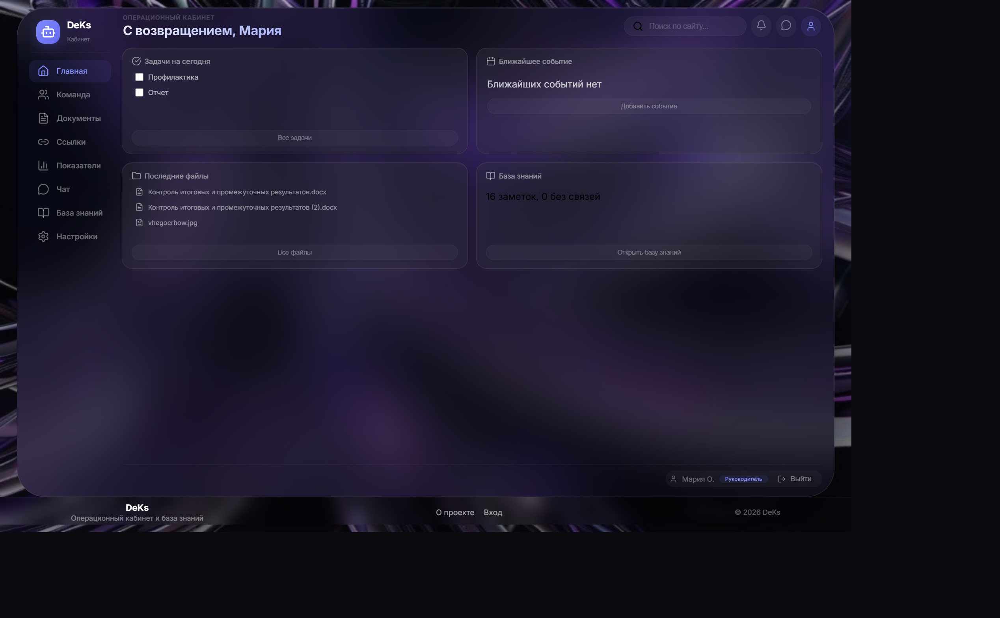
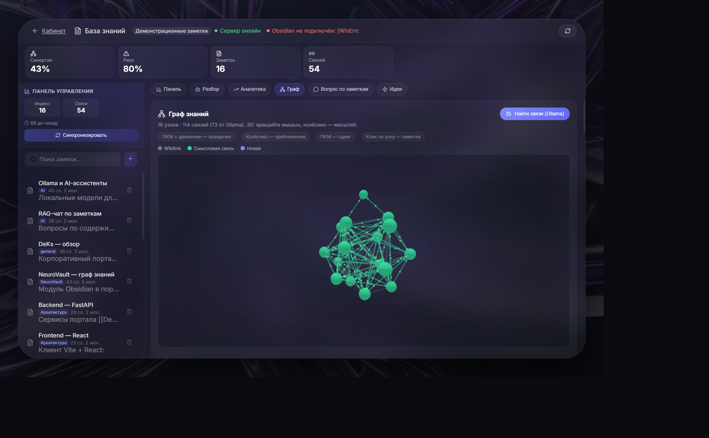

# DeKs

Корпоративный аналитический сервис. Одно рабочее место, в котором сходятся показатели, база знаний и ежедневная операционная работа команды.

## Зачем он нужен

В компаниях задачи, переписка, документы и заметки живут в разных местах. Решение принимается без контекста, который уже записан. DeKs собирает этот контур обратно: человек видит, что происходит, и может опереться на знания, а не искать их по чатам.

## Что умеет

- **Операционный дашборд.** Задачи, календарь, документы, общие ссылки, показатели, уведомления и поиск по рабочему пространству.
- **Разбор страницы.** Заголовки, ссылки и таблицы с публичной страницы, прямо из кабинета.
- **Коммуникации.** Общий и личный чат, вложения, непрочитанные.
- **База знаний.** Живое хранилище Obsidian, двусторонний обмен и собственный индекс заметок.
- **AI-агент.** Читает каталог заметок и пишет разбор: темы, пробелы, риски и что связать дальше.
- **Аналитика по знаниям.** Метрики хранилища, инсайты, смысловые связи и идеи на пересечении заметок.
- **Граф.** Трёхмерная карта: явные ссылки и связи, которые нашла модель.
- **Ассистент.** Общий чат и отдельный режим, который отвечает по заметкам и показывает источники.

## Obsidian

Заметки не уезжают в чужой формат. Команда продолжает писать их в Obsidian, а DeKs подключается к тому же хранилищу.

Связка двусторонняя. Сервис ходит в Obsidian через Local REST API и умеет читать ту же папку с диска, если API недоступен. Из интерфейса заметку можно открыть, создать, изменить и удалить. Изменения уходят обратно в vault. Если заметка изменилась в Obsidian, webhook ставит синхронизацию в очередь, и индекс подтягивается сам.

На синхронизации сервис не просто копирует текст. Он разбирает заголовки, папки, теги и `[[wikilink]]`, считает объём и складывает это в SQLite. Дальше экраны аналитики читают индекс, а не дёргают Obsidian на каждый клик. После синхронизации в фоне считаются эмбеддинги. Если заметок больше одной, сразу запускается поиск смысловых связей.

В репозитории лежит демонстрационное хранилище `HAC`: архитектура, процессы, дашборд, мессенджер и граф. Контур можно открыть на этих заметках, без чужих корпоративных данных.

## AI-агент

Агент работает по хранилищу, а не по одному сообщению в чате. Он собирает каталог: путь, тема, число слов, короткое превью, уже найденные связи и сводку по vault. По этому пакету модель пишет отчёт и сохраняет его. Отчёт можно открыть снова, не запуская анализ заново.

Структура отчёта фиксированная, чтобы его можно было читать как рабочий документ:

- обзор базы знаний
- ключевые темы и кластеры
- пробелы, изолированные заметки и дубли
- какие заметки связать через `[[wikilink]]` и почему
- три конкретных следующих шага

Перед текстом агент сам ищет новые смысловые пары. Найденное попадает и в отчёт, и на граф.

Вокруг агента собран отдельный интеллектуальный слой. Это не одна кнопка.

- **Ответ по заметкам.** Вопрос ищет ближайшие фрагменты по эмбеддингам. Ответ приходит вместе с источниками. Если в хранилище ничего подходящего нет, ассистент так и говорит, а не придумывает цитату.
- **Смысловые связи.** Модель смотрит пары, которые человек ещё не связал вручную, и объясняет, зачем их соединять.
- **Идеи на пересечении.** Близкие по смыслу и ещё не связанные заметки превращаются в гипотезу: что из них можно сделать вместе.
- **Граф и ландшафт.** На трёхмерной карте обычные ссылки и связи модели выглядят по-разному. Ландшафт раскладывает заметки по их смысловой близости.
- **Разбор хранилища.** Объём, папки, теги, активность по неделям, заметки-хабы, заметки без связей и общая оценка здоровья базы.
- **Метрики для руководителя.** Плотность связей, пересечения между темами, риски и опорные заметки. Из этих цифр собираются инсайты, а модель сжимает их в короткий вывод.
- **Два режима диалога.** Общий ассистент отвечает про сам портал. Отдельный режим отвечает только из заметок.

Операционное рабочее место и аналитика знаний сделаны как один продукт, но интеллект не прибит к обычному чату. Синхронизация, эмбеддинги, связи, метрики, отчёт агента и RAG идут своим контуром `/api/intelligence`.

## Как это собрано

Клиент на React говорит с API на FastAPI. Пользователи, рабочее пространство и мессенджер лежат в SQLite. Заметки остаются markdown-хранилищем: сервис их синхронизирует, считает эмбеддинги, строит связи и отдаёт их в граф и в RAG.

Отдельный интеллектуальный контур не смешивается с обычными CRUD-операциями. Синхронизация, обогащение, поиск связей и ответы ассистента идут своим маршрутом `/api/intelligence`.

```text
React / Vite
    │
    ▼
FastAPI
    ├── workspace, messenger, profile
    ├── SQLite
    ├── Obsidian Local REST API  ↔  markdown vault
    └── intelligence
            ├── vault sync and note index
            ├── embeddings
            ├── semantic links and ideas
            ├── graph, landscape, metrics, insights
            ├── vault agent report
            └── RAG with sources
                    │
                    ▼
              local model
```

## Стек

| Слой | Технологии |
| --- | --- |
| Интерфейс | React, Vite, трёхмерный граф |
| API | Python, FastAPI |
| Данные | SQLite, markdown-хранилище |
| Интеллект | Локальная модель, эмбеддинги, RAG |
| Поставка | Docker Compose |

## Запуск

Команда, которой поднимается проект:

```bat
start-all.bat
```

Перед первым запуском скопируйте `.env.example` в `.env` и заполните ключи. Пустые значения в примере не подставляют чужие секреты: адреса Obsidian и модели задаются у себя.

Интерфейс открывается на `http://localhost:5173`, API слушает порт `3001`. Вход выдаёт сессию в httpOnly-cookie. Пароль в базе хранится только как хэш.

## Как это выглядит

Кабинет. На первом экране задачи на сегодня, ближайшее событие, последние файлы и строка по базе знаний. Показатели, ссылки, документы и разбор страницы остаются в том же рабочем месте.



База знаний: демонстрационные заметки, граф и ответ по источникам.



Вручную:

```bash
cd server
python -m venv .venv
.venv\Scripts\activate
pip install -r requirements.txt
python -m uvicorn main:app --host 0.0.0.0 --port 3001 --reload
```

```bash
cd client
npm install
npm run dev
```

Либо `docker-compose up -d`.

Ключ хранилища и пути задаются только в `.env`. В репозиторий они не входят.
